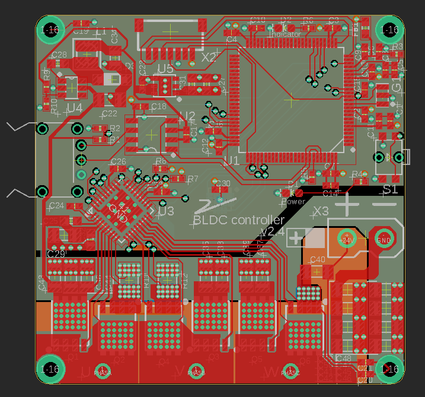
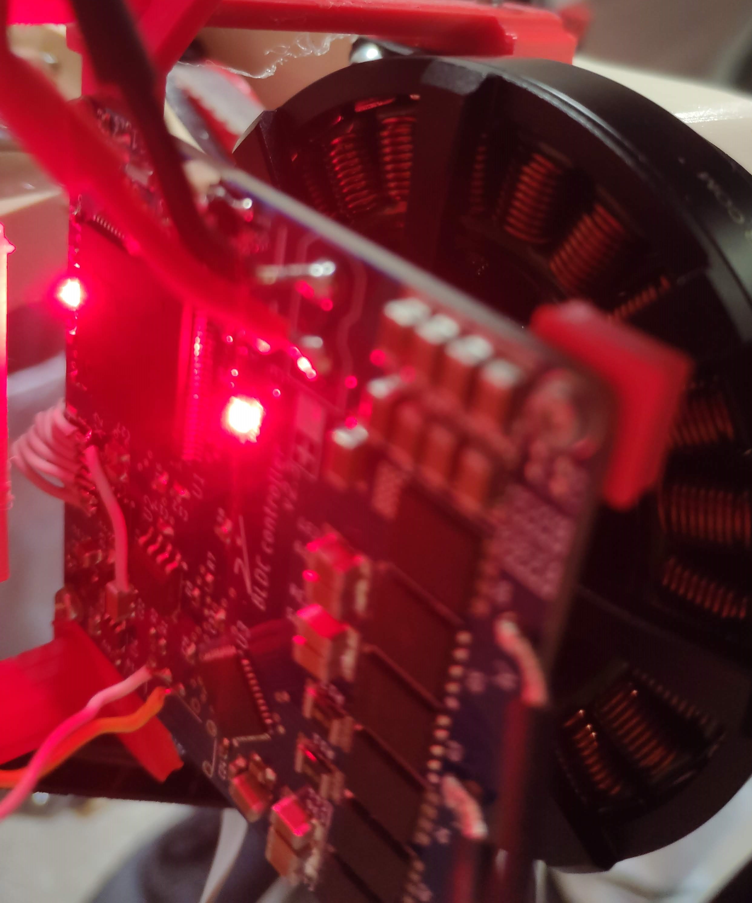

# BLDC motor controller Hardware

| Eagle PCB| Mounted PCB Controller |
:-:|:-:
 |  

## Credits
Controller based on [3phase_integrated from Ben Katz](https://github.com/bgkatz/3phase_integrated)

